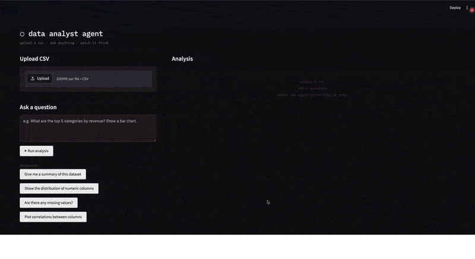
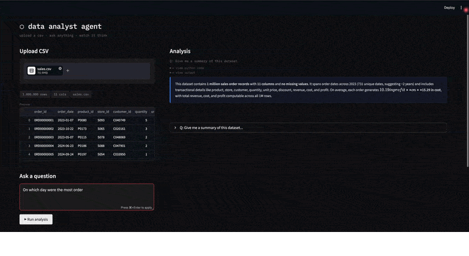
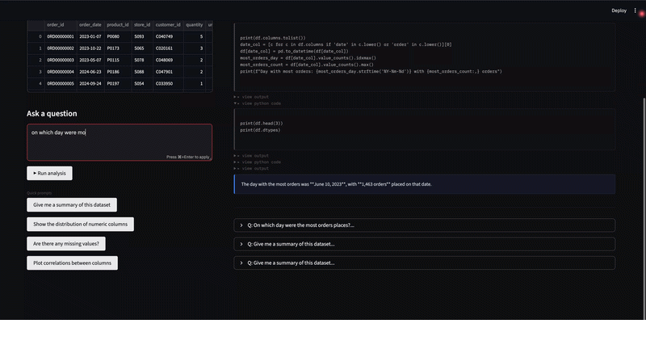

# Data Analyst Agent

An autonomous AI agent that analyzes CSV files by writing and executing Python code in a loop — powered by Claude's tool use API.

Upload a CSV, ask a question in plain English, and watch the agent plan, write code, run it, interpret results, and answer you — all without any hand-holding. Ask follow-up questions and the agent remembers the full conversation context.

---

## Demo

### 1. Upload a CSV and use quick prompts
Upload any CSV file and get instant insights using the built-in quick prompt buttons.



---

### 2. Ask your own question
Type any custom question in plain English and watch the agent write and execute Python code to answer it.



---

### 3. Follow-up with context
Ask a follow-up question — the agent remembers the full conversation and builds on its previous answer.



---

## Architecture

```
User question + message history
     │
     ▼
┌─────────────────────────────────────┐
│           Agentic Loop              │
│                                     │
│  Claude (claude-opus-4-6)           │
│    ├─ decides what code to write    │
│    ├─ calls run_python tool         │
│    └─ interprets output             │
│                                     │
│  run_python tool                    │
│    ├─ injects df = pd.read_csv(...) │
│    ├─ executes code via subprocess  │
│    └─ returns stdout + chart paths  │
│                                     │
│  Message history                    │
│    ├─ full conversation maintained  │
│    └─ enables multi-turn follow-ups │
│                                     │
│  Loop continues until end_turn      │
└─────────────────────────────────────┘
     │
     ▼
Streamlit UI (streaming step-by-step)
```

Key agentic properties:
- **Multi-step reasoning**: the agent runs multiple tool calls per question
- **Multi-turn conversation**: full message history passed on every question so the agent remembers context
- **Self-directed**: it decides what to explore without being told
- **Error-aware**: stderr is returned to the model so it can self-correct
- **Transparent**: collapsible code and output panels show the agent's thinking

---

## Setup

### 1. Clone & install

```bash
git clone https://github.com/YOUR_USERNAME/data-analyst-agent
cd data-analyst-agent
python -m venv .venv
source .venv/bin/activate
pip install -r requirements.txt
```

### 2. Set your API key

```bash
export ANTHROPIC_API_KEY=sk-ant-...
```

Or add it permanently to your shell:
```bash
echo 'export ANTHROPIC_API_KEY=sk-ant-...' >> ~/.zshrc
source ~/.zshrc
```

### 3. Run

```bash
streamlit run app.py
```

Open http://localhost:8501

---

## Project Structure

```
data-analyst-agent/
├── agent.py          # Agentic loop + tool execution + message history
├── app.py            # Streamlit UI with session state
├── requirements.txt
├── .gitignore
└── README.md
```

### `agent.py`
- `run_agent(csv_path, question, chart_dir, message_history)` — generator that yields events, maintains conversation history across turns
- `execute_python(code, csv_path, chart_dir)` — runs code in subprocess, captures stdout + charts
- `TOOLS` — Claude tool definition for `run_python`

### `app.py`
- Streamlit UI with file upload, question input, quick prompts
- Streams agent events live as they arrive
- Collapsible code and output panels
- Persistent multi-turn conversation via session state

---

## Example questions to try

- "Give me a summary of this dataset"
- "Which columns have missing values and how many?"
- "Show the distribution of [column_name]"
- "What are the top 10 rows by [column]? Show as a bar chart."
- "Is there a correlation between [col_a] and [col_b]?"
- "Group by [category_col] and show average [numeric_col]"

Then follow up with: "Tell me more about that" or "Now show it as a pie chart"

---

## Extending this project

Ideas to take it further:
- **E2B sandbox**: replace subprocess with [E2B](https://e2b.dev) for secure cloud execution
- **More tools**: add `save_csv`, `run_sql`, `fetch_url` tools
- **Export**: let users download the generated code as a `.py` file
- **Memory summarization**: compress old conversation history to save tokens

---

## Tech stack

| Layer | Tech |
|---|---|
| LLM | Anthropic Claude (claude-opus-4-6) |
| Agent framework | Raw tool use loop (no LangChain) |
| Code execution | Python subprocess |
| UI | Streamlit |
| Data | pandas, matplotlib, seaborn |

---

## Skills demonstrated

| Skill | How it shows up |
|---|---|
| Python | End-to-end project — agent logic, file I/O, subprocess, Streamlit UI |
| Anthropic Claude API | Tool use, multi-step agentic loop, message history management |
| Agentic AI | Agent that plans, writes code, executes, interprets, and loops autonomously |
| Multi-turn conversation | Full message history maintained across questions via session state |
| Tool use / function calling | Custom `run_python` tool definition and execution cycle |
| Data analysis | pandas, matplotlib, seaborn for CSV exploration and visualization |
| Streamlit | Interactive web UI with live streaming, file upload, session state |
| HTML/CSS | Custom dark theme UI via injected styles in Streamlit |
| Software design | Clean separation of agent logic (`agent.py`) and UI (`app.py`) |

---

## License

MIT
